# JS-Basics

For beginners looking to build a strong foundation in JavaScript, check out this JavaScript Basics [Roadmap](https://whimsical.com/js-basics-roadmap-HxsoYtVkawZbjC1gcy61Cc).

Js array and object assignments: [Here](https://brindle-goal-102.notion.site/QUESTIONS-FOR-JS-WEEKEND-26d46b36b2e980a0b299fbf0d87840af) *[Need to know Object.keys , .values , .entries as well]*

# JavaScript Practice Questions

This repository contains solutions to 40 JavaScript practice questions focused on:

- Objects
- Arrays
- reduce()
- map()
- filter()
- Object.entries()
- Object.keys()
- Data transformation
- Grouping and counting logic

## Topics Covered

### Objects
- Swapping keys and values
- Filtering object entries
- Query string conversion
- Finding common keys
- Object sorting

### Arrays
- Counting occurrences
- Grouping data
- Flattening arrays
- Unique values
- Lookup object creation

## Sample Questions

1. Sum values in object arrays
2. Count word occurrences
3. Group people by city
4. Find highest average marks
5. Convert array to lookup object

# Pre-requiste
Before solving the question learn about Objects and Array then go through the assignment questions.
After solving this questions You will get a deep Understanding of How object and Array works together.
Each file contains five question Before running my code commen the code and then execute it for better results.

# What we learn from this repo and Explanation of the Code.
A curated collection of JavaScript problems focused on Objects, Arrays, Loops, Transformations, and Data Manipulation.
This repository demonstrates problem-solving skills using core JavaScript concepts without relying heavily on external libraries.

It also includes:

Clean and beginner-friendly solutions
Logic building practice
Real interview-style coding questions
Handwritten explanations for deeper understanding

# Concept Practiced
| Concept            | Usage                    |
| ------------------ | ------------------------ |
| `for...in`         | Iterating objects        |
| `for...of`         | Iterating arrays         |
| `Object.keys()`    | Extract object keys      |
| `Object.values()`  | Extract object values    |
| `Object.entries()` | Convert object to arrays |
| `reduce()`         | Data aggregation         |
| `Set`              | Removing duplicates      |
| `filter()`         | Conditional selection    |
| `sort()`           | Sorting arrays           |
| `URLSearchParams`  | Query string generation  |

# 📸 Handwritten Notes

### Objects & Arrays Notes
In this image we learn about for--in and for--of loop and How we find unique element in an array.

How set is used and it's use cases and second one is How to cnvrt object to array.
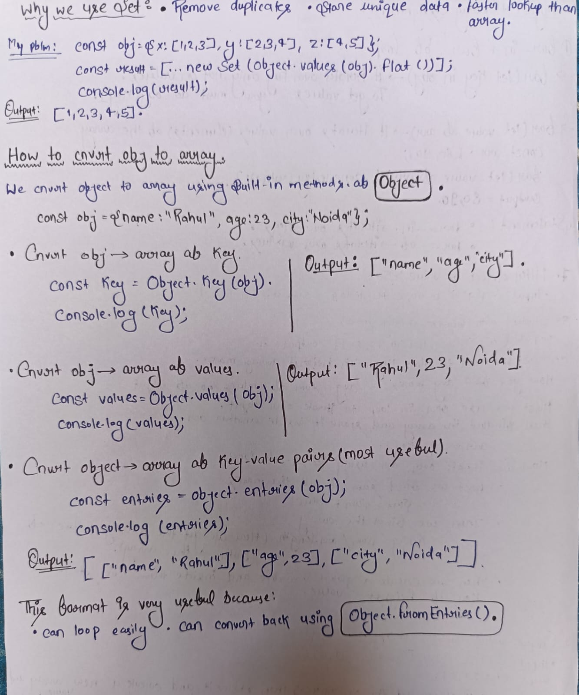
How we use In-built method to sort an array and how sort works in string.
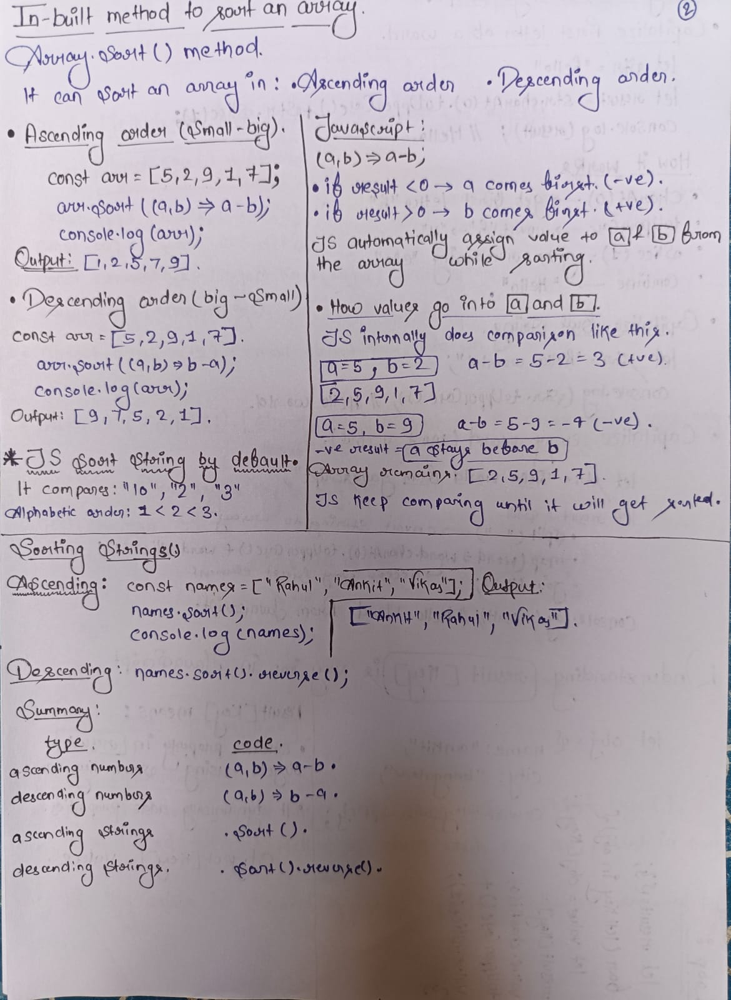
How object to query string works using in-built method 
Built-in methods to find common key between two objects.
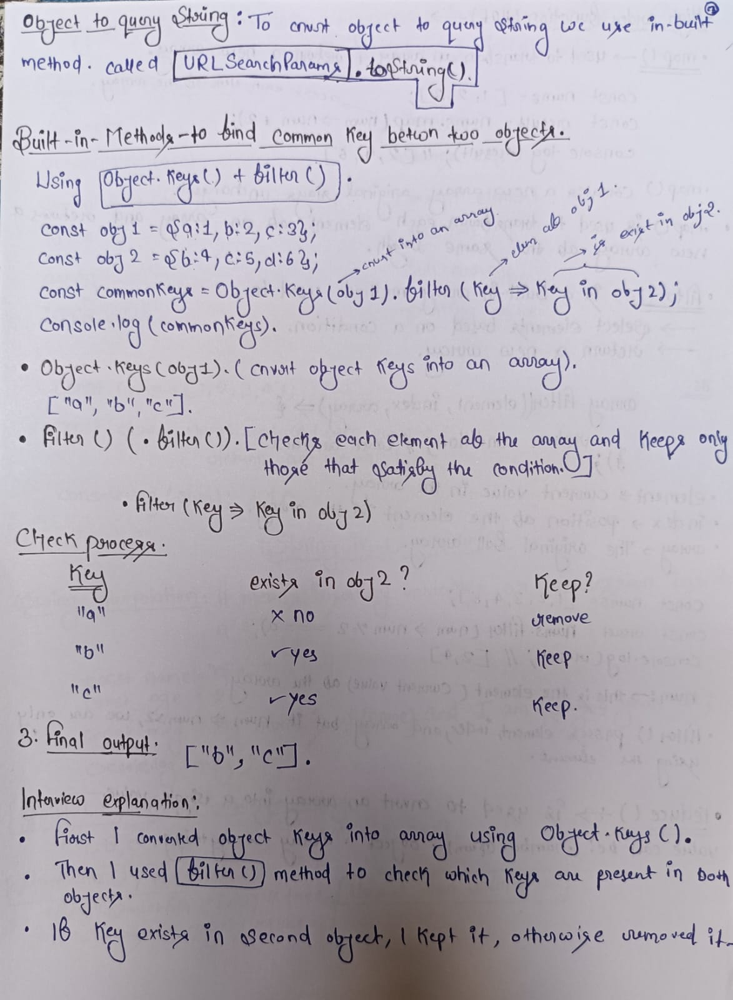

# 02_intermediate
How object stores value and update them.
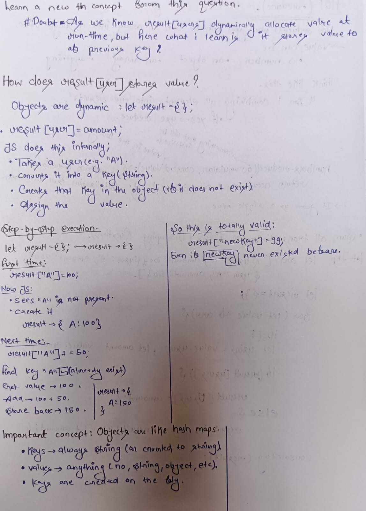
In this we know about how value allocates to other object dynamically.
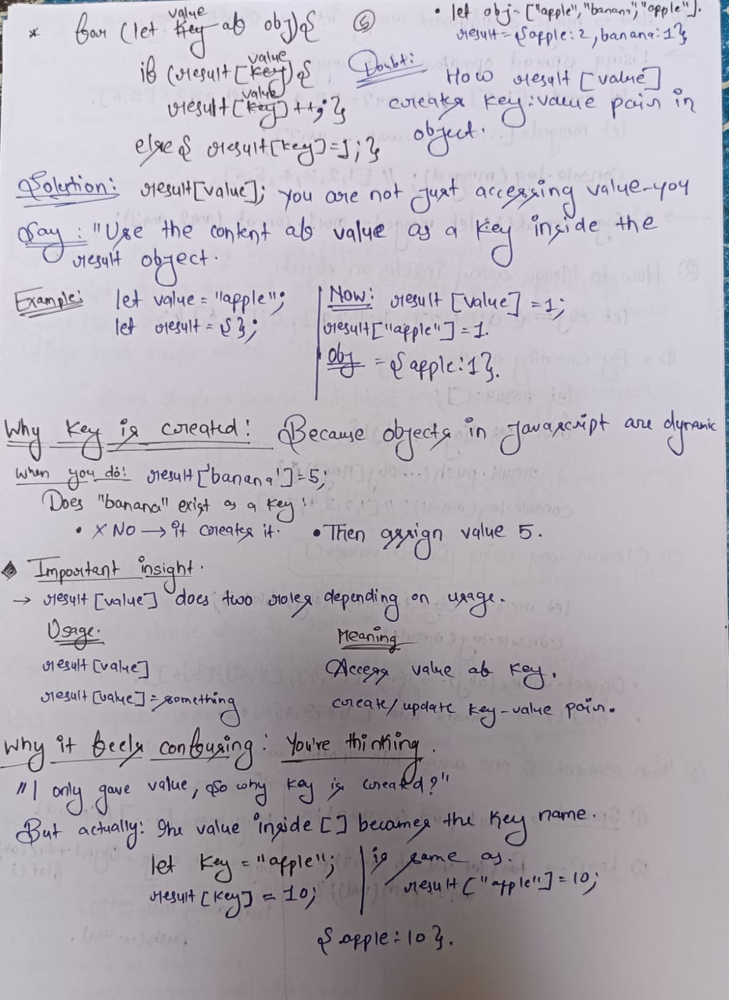
How we merge array by using different method and How elem pushed into another array.
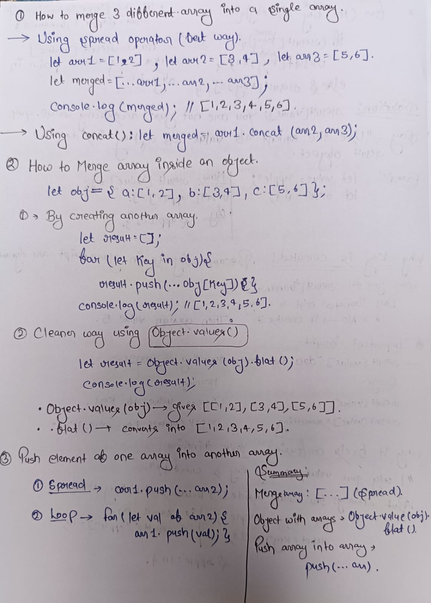
How hashing concept works internally.
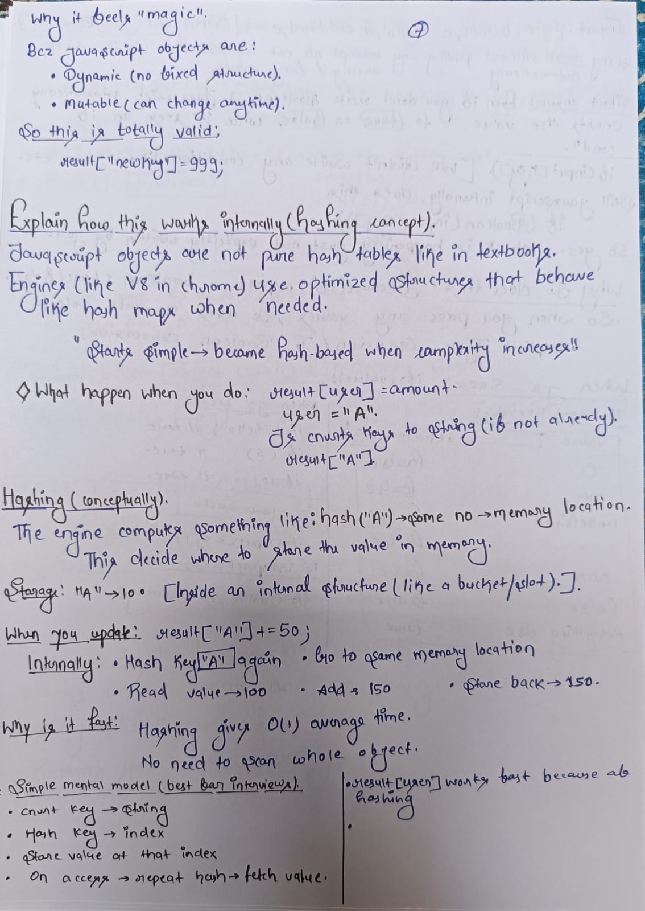
Question with doubt
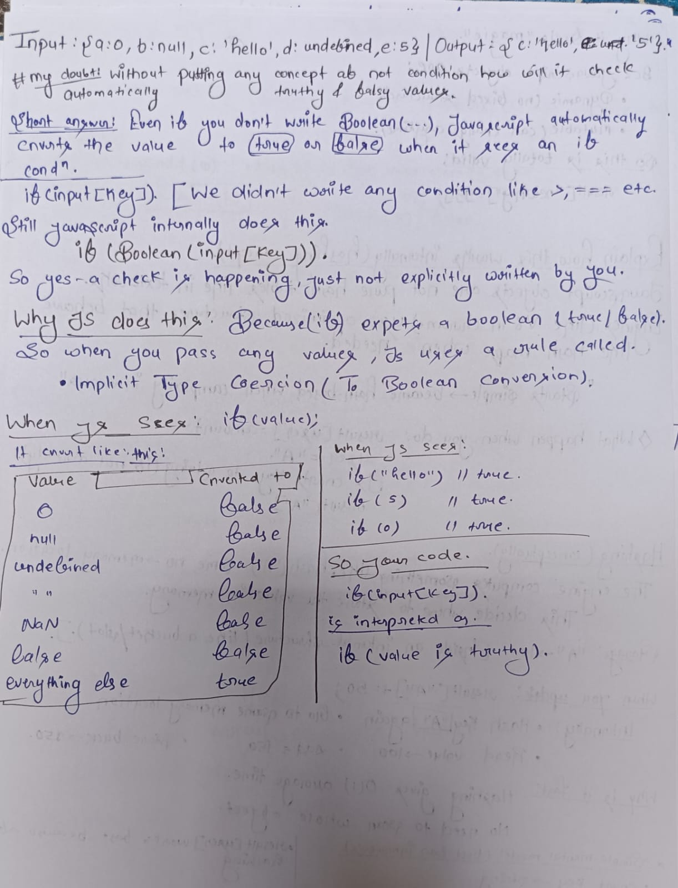
Chunk in an array and How slice works 
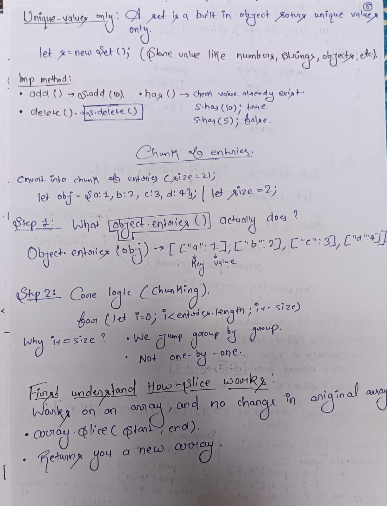
All about Slice in js.
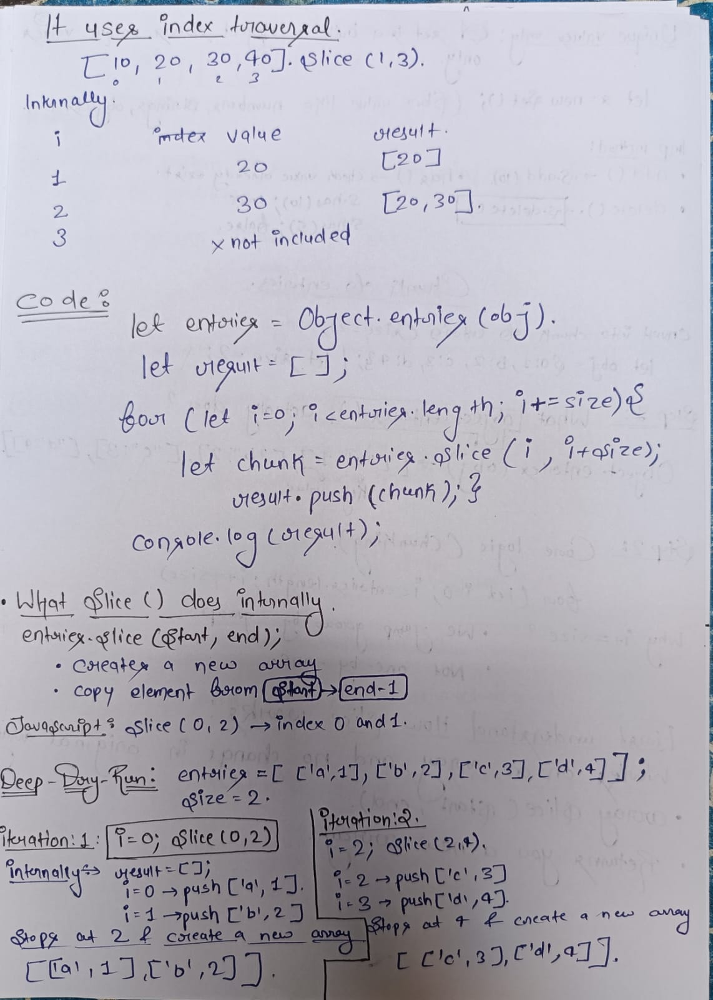
Pattern to find max/min/longest/shortest types of problems.
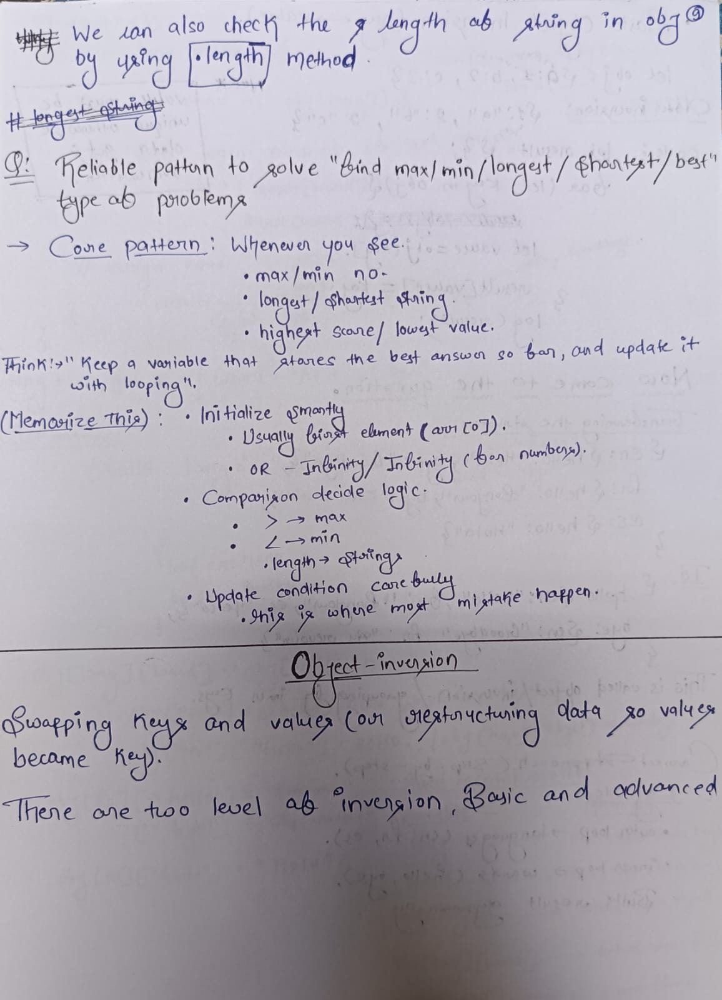
Object inversion in javascript
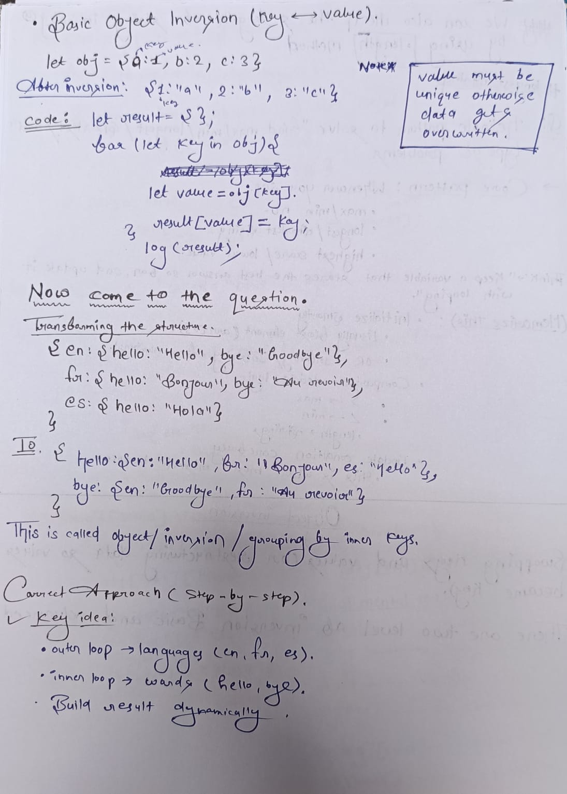
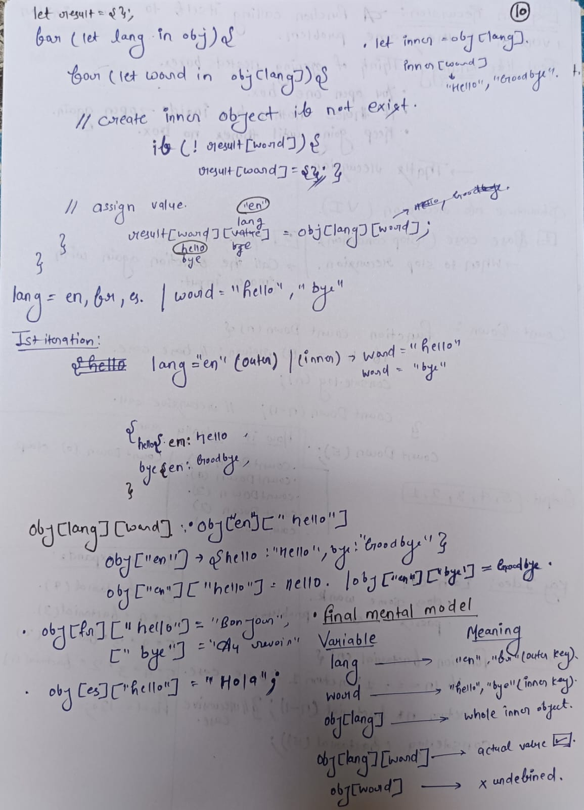
How recursion works 
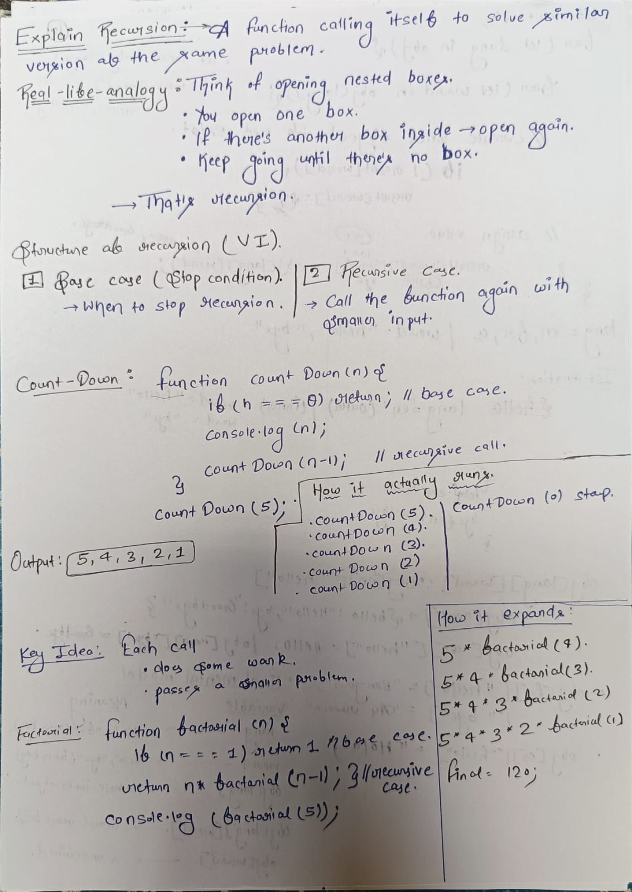
# Have a good day.
