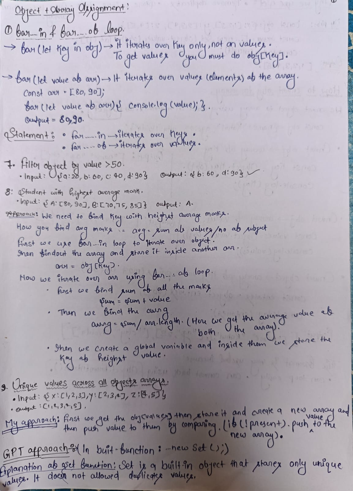

# JS-Basics

For beginners looking to build a strong foundation in JavaScript, check out this JavaScript Basics [Roadmap](https://whimsical.com/js-basics-roadmap-HxsoYtVkawZbjC1gcy61Cc).

Js array and object assignments: [Here](https://brindle-goal-102.notion.site/QUESTIONS-FOR-JS-WEEKEND-26d46b36b2e980a0b299fbf0d87840af) *[Need to know Object.keys , .values , .entries as well]*

# JavaScript Practice Questions

This repository contains solutions to 40 JavaScript practice questions focused on:

- Objects
- Arrays
- reduce()
- map()
- filter()
- Object.entries()
- Object.keys()
- Data transformation
- Grouping and counting logic

## Topics Covered

### Objects
- Swapping keys and values
- Filtering object entries
- Query string conversion
- Finding common keys
- Object sorting

### Arrays
- Counting occurrences
- Grouping data
- Flattening arrays
- Unique values
- Lookup object creation

## Sample Questions

1. Sum values in object arrays
2. Count word occurrences
3. Group people by city
4. Find highest average marks
5. Convert array to lookup object

# Pre-requiste
Before solving the question learn about Objects and Array then go through the assignment questions.
After solving this questions You will get a deep Understanding of How object and Array works together.
Each file contains five question Before running my code commen the code and then execute it for better results.

# What we learn from this repo and Explanation of the Code.
A curated collection of JavaScript problems focused on Objects, Arrays, Loops, Transformations, and Data Manipulation.
This repository demonstrates problem-solving skills using core JavaScript concepts without relying heavily on external libraries.

It also includes:

Clean and beginner-friendly solutions
Logic building practice
Real interview-style coding questions
Handwritten explanations for deeper understanding

# Concept Practiced
| Concept            | Usage                    |
| ------------------ | ------------------------ |
| `for...in`         | Iterating objects        |
| `for...of`         | Iterating arrays         |
| `Object.keys()`    | Extract object keys      |
| `Object.values()`  | Extract object values    |
| `Object.entries()` | Convert object to arrays |
| `reduce()`         | Data aggregation         |
| `Set`              | Removing duplicates      |
| `filter()`         | Conditional selection    |
| `sort()`           | Sorting arrays           |
| `URLSearchParams`  | Query string generation  |

# 📸 Handwritten Notes

# Have a good day.
